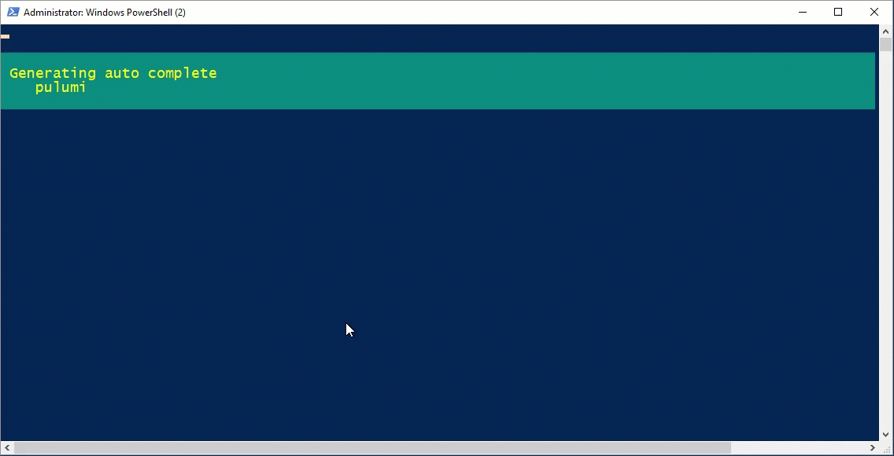

# PSPulumi

Pulumi provides a Cloud Native Development Platform to help teams achieve maximum productivity, unify DevOps practices, and get code to the cloud faster than ever before with a consistent programming model.

# What's new 1.0.7

* Generated  02/02/2019 pulumi version v0.16.14
    * Additional `--json` parameters for existing options
    * Update history for a stack
    * Manage stack tags

# What's new 1.0.1

PowerShell argument completion for the Pulumi cli.

